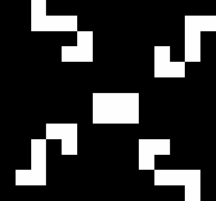
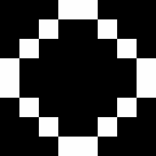

# Data

|   |   |
|---|---|
|[25P3H1.life](#25P3H1.life)|25P3H1V0.|
|[blocker.life](#blocker.life)|Blocker is a period 8 oscillator found by Robert Wainwright.|
|[boatTie.life](#boatTie.life)|Boat-tie (or bi-boat) is a small still life whose name is a pun on 'bow tie'.|
|[bookend.life](#bookend.life)|Bookend (or hook) is generation 1 of century and an induction coil.|
|[dinnerTable.life](#dinnerTable.life)|Dinner table is a period 12 oscillator.|
|[figureEight.life](#figureEight.life)|Figure eight (or less frequently, big beacon) is a period 8 oscillator found by Simon Norton in 1970.|
|[glider.life](#glider.life)|A glider (or featherweight spaceship) is the smallest, most common, and first-discovered spaceship.|
|[heavySpaceship.life](#heavySpaceship.life)|The heavyweight spaceship (or HWSS for short) is the fourth most common spaceship (after the glider, lightweight spaceship and middleweight spaceship).|
|[octagon.life](#octagon.life)|Octagon 2 was the first known period 5 oscillator, discovered in 1971 independently by Sol Goodman and Arthur Taber.|
|[pentaDecathlon.life](#pentaDecathlon.life)|Pentadecathlon (or PD) is a period 15 oscillator that was found in 1970 by John Conway while tracking the history of short rows of cells (see one cell thick pattern).|
|[pulsar.life](#pulsar.life)|Pulsar is, despite its size, the fourth most common oscillator (and by far the most common of period greater than 2).|
|[rPentomino.life](#rPentomino.life)|The R-pentomino is a methuselah that was found by John Conway in 1970.|
|[rabbits.life](#rabbits.life)|Rabbits is a methuselah that was found by Andrew Trevorrow in 1986.|

## 25P3H1.life

{class="center"}

  
  
25P3H1V0.2 is an unnamed c/3 orthogonal spaceship discovered by Dean Hickerson in August 1989 and was the first c/3 spaceship to be discovered. In terms of its 25 cells, it is tied with 25P3H1V0.1 as the smallest c/3 spaceship, although unlike 25P3H1V0.1, it has a population of 25 in all of its phases, as well as a smaller bounding box.

- **File:** [25P3H1.life](../data/25P3H1.life)
- **Source:** [http://www.conwaylife.com/wiki/25P3H1V0.2](http://www.conwaylife.com/wiki/25P3H1V0.2)

## blocker.life

{class="center"}

  
  
Blocker is a period 8 oscillator found by Robert Wainwright.

- **File:** [blocker.life](../data/blocker.life)
- **Source:** [http://www.conwaylife.com/wiki/Blocker](http://www.conwaylife.com/wiki/Blocker)

## boatTie.life

{class="center"}

  
  
Boat-tie (or bi-boat) is a small still life whose name is a pun on 'bow tie'. It is the twentieth most common still life, being less common than Integral sign but more common than snake.

- **File:** [boatTie.life](../data/boatTie.life)
- **Source:** [http://www.conwaylife.com/wiki/Boat-tie](http://www.conwaylife.com/wiki/Boat-tie)

## bookend.life

{class="center"}

  
  
Bookend (or hook) is generation 1 of century and an induction coil.

- **File:** [bookend.life](../data/bookend.life)
- **Source:** [http://www.conwaylife.com/wiki/Bookend](http://www.conwaylife.com/wiki/Bookend)

## dinnerTable.life

{class="center"}

  
  
Dinner table is a period 12 oscillator. It was the first period 12 oscillator to be found, and was discovered by Robert Wainwright in 1972. It consists of four eater 1s hassling a pre-beehive.

- **File:** [dinnerTable.life](../data/dinnerTable.life)
- **Source:** [http://www.conwaylife.com/wiki/Dinner_table](http://www.conwaylife.com/wiki/Dinner_table)

## figureEight.life

{class="center"}

  
  
Figure eight (or less frequently, big beacon) is a period 8 oscillator found by Simon Norton in 1970.

- **File:** [figureEight.life](../data/figureEight.life)
- **Source:** [http://www.conwaylife.com/wiki/Figure_eight](http://www.conwaylife.com/wiki/Figure_eight)

## glider.life

{class="center"}

  
  
A glider (or featherweight spaceship) is the smallest, most common, and first-discovered spaceship. Its name is due in part to the fact that it is glide symmetric. It travels diagonally across the Life grid at a speed of c/4 and is often produced by randomly-generated starting patterns.

- **File:** [glider.life](../data/glider.life)
- **Source:** [http://www.conwaylife.com/wiki/Glider](http://www.conwaylife.com/wiki/Glider)

## heavySpaceship.life

{class="center"}

  
  
The heavyweight spaceship (or HWSS for short) is the fourth most common spaceship (after the glider, lightweight spaceship and middleweight spaceship). It was found by John Conway in 1970 and travels at a speed of c/2 orthogonally.

- **File:** [heavySpaceship.life](../data/heavySpaceship.life)
- **Source:** [http://www.conwaylife.com/wiki/Heavyweight_spaceship](http://www.conwaylife.com/wiki/Heavyweight_spaceship)

## octagon.life

{class="center"}

  
  
Octagon 2 was the first known period 5 oscillator, discovered in 1971 independently by Sol Goodman and Arthur Taber. The name is due to the latter.

- **File:** [octagon.life](../data/octagon.life)
- **Source:** [http://www.conwaylife.com/wiki/Octagon_2](http://www.conwaylife.com/wiki/Octagon_2)

## pentaDecathlon.life

{class="center"}

  
  
Pentadecathlon (or PD) is a period 15 oscillator that was found in 1970 by John Conway while tracking the history of short rows of cells (see one cell thick pattern).

- **File:** [pentaDecathlon.life](../data/pentaDecathlon.life)
- **Source:** [http://www.conwaylife.com/wiki/Pentadecathlon](http://www.conwaylife.com/wiki/Pentadecathlon)

## pulsar.life

{class="center"}

  
  
Pulsar is, despite its size, the fourth most common oscillator (and by far the most common of period greater than 2).

- **File:** [pulsar.life](../data/pulsar.life)
- **Source:** [http://www.conwaylife.com/wiki/Pulsar](http://www.conwaylife.com/wiki/Pulsar)

## rPentomino.life

{class="center"}

  
  
The R-pentomino is a methuselah that was found by John Conway in 1970. It is by far the most active polyomino with fewer than six cells; all of the others stabilize in at most 10 generations, but the R-pentomino does not do so until generation 1103, by which time it has a population of 116.

- **File:** [rPentomino.life](../data/rPentomino.life)
- **Source:** [http://www.conwaylife.com/wiki/R-pentomino](http://www.conwaylife.com/wiki/R-pentomino)

## rabbits.life

{class="center"}

  
  
Rabbits is a methuselah that was found by Andrew Trevorrow in 1986. It is generation 1 of bunnies.

- **File:** [rabbits.life](../data/rabbits.life)
- **Source:** [http://www.conwaylife.com/wiki/Rabbits](http://www.conwaylife.com/wiki/Rabbits)