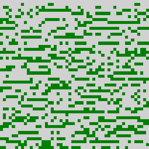
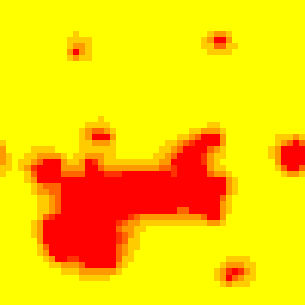

# Examples

|   |   |
|---|---|
|[bv-scenario](#bv-scenario)|A scenario for the BandedVegetation model.|
|[daisy-scenario](#daisy-scenario)|Daisy world example with larger range of reproducing temperature and more life span.|

## [bv-scenario](../examples/bv-scenario.lua)

{class="center"}

  
  
A scenario for the BandedVegetation model.  
  

## [daisy-scenario](../examples/daisy-scenario.lua)

{class="center"}

  
  
Daisy world example with larger range of reproducing temperature and more life span.