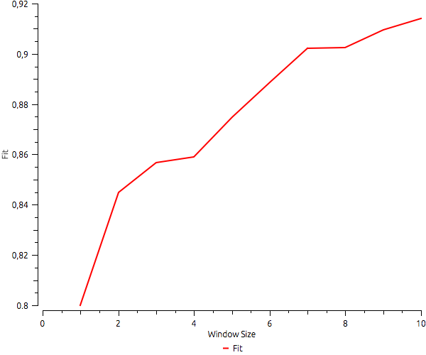
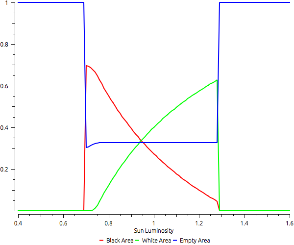
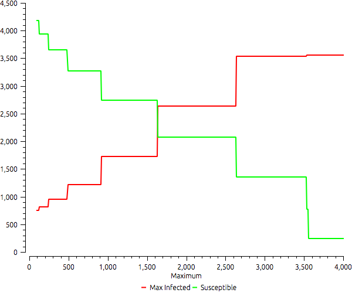
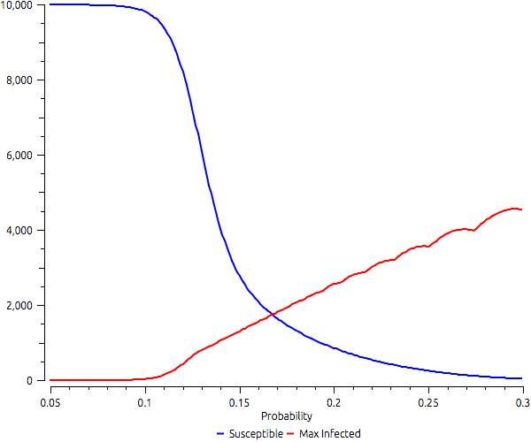
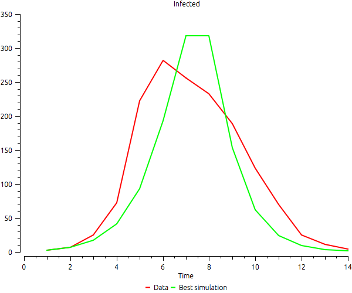
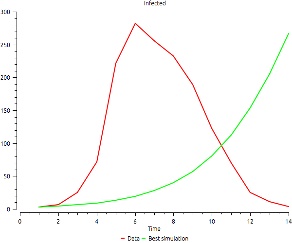
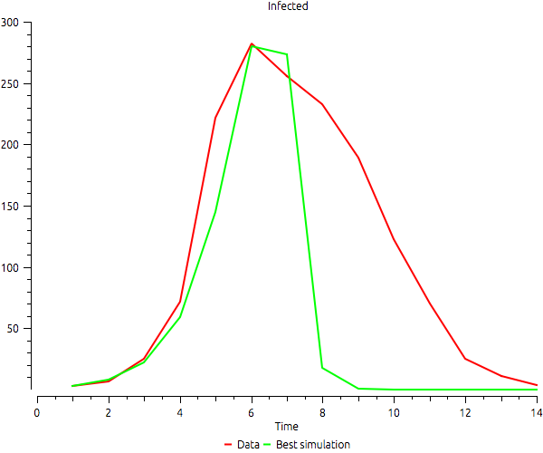
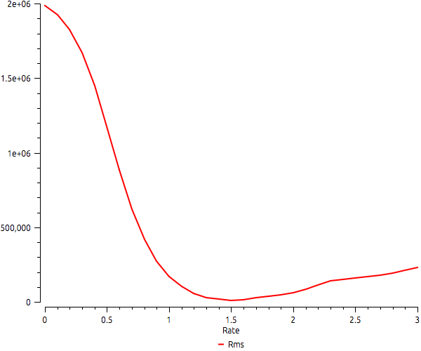
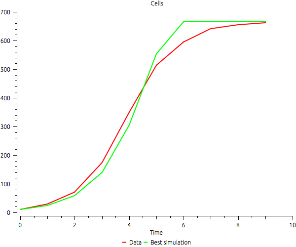

# Examples

|   |   |
|---|---|
|[broeke](#broeke)|An implementation of the model described in ten Broeke, Guus, George van Voorn, and Arend Ligtenberg.|
|[costanza](#costanza)|Basic example for testing goodness-of-fit.|
|[daisy](#daisy)|Daisyworld example using multiple Runs factorial strategy.|
|[fire-average](#fire-average)|Fire in the forest example using multiple runs repeateated strategy.|
|[moving-agents](#moving-agents)|Example that uses MultipleRuns to compute wow many cells agents moving randomly can reach.|
|[sir-mr-campaign](#sir-mr-campaign)|Multiple simulations of a Susceptible-Infected-Recovered (SIR) model with a public campaign.|
|[sir-mr-probability](#sir-mr-probability)|Investigating the probability of infection in a Susceptible-Infected-Recovered (SIR) model.|
|[sir-samde-fit](#sir-samde-fit)|Infection example using SaMDE, simulates an infection spreading inside a school.|
|[sir-samde-max-infected](#sir-samde-max-infected)|An example of a bad calibration.|
|[sir-samde-point](#sir-samde-point)|Calibration of a SIR model using a single point.|
|[yeast-mr](#yeast-mr)|Basic example for testing MultipleRuns using Yeast model.|
|[yeast-samde](#yeast-samde)|Basic example for SAMDE using Yeast model.|

## [broeke](../examples/broeke.lua)

An implementation of the model described in ten Broeke, Guus, George van Voorn, and Arend Ligtenberg. "Which Sensitivity Analysis Method Should I Use for My Agent-Based Model?." Journal of Artificial Societies & Social Simulation 19.1 (2016). [http://jasss.soc.surrey.ac.uk/19/1/5.html.](http://jasss.soc.surrey.ac.uk/19/1/5.html.)  
  

## [costanza](../examples/costanza.lua)

{class="center"}

  
  
Basic example for testing goodness-of-fit. This example reproduces Figure 4 of from Costanza R. Model goodness of fit: a multiple resolution procedure. Ecological modelling. 1989 Sep 15;47(3-4):199-215.  
  

## [daisy](../examples/daisy.lua)

{class="center"}

  
  
Daisyworld example using multiple Runs factorial strategy. It simulates Daisyworld using different sun luminosities to investigate the final distribution of black, white, and empty areas. Based on the Model described in Wood, A. J., G. J. Ackland, J. G. Dyke, H. T. P. Williams, and T. M. Lenton (2008), Daisyworld: A review, Rev. Geophys., 46.  
  

## [fire-average](../examples/fire-average.lua)

Fire in the forest example using multiple runs repeateated strategy.  
  

## [moving-agents](../examples/moving-agents.lua)

Example that uses MultipleRuns to compute wow many cells agents moving randomly can reach. It uses a model that starts with a given number of agents randomly distributed in space and runs a small number of steps. The output shows a logistic growth of cells where at least one agent has passed during each simulation. Note that the curve sometimes has a negative derivative. As we increase the initial number of agents, sometimes the number of covered cells diminishes due to randomness.  
  

## [sir-mr-campaign](../examples/sir-mr-campaign.lua)

{class="center"}

  
  
Multiple simulations of a Susceptible-Infected-Recovered (SIR) model with a public campaign. The campaign asks the population to stop leaving home, which reduces the number of contacts by half. The example shows the outcomes given different thresholds to start the campaign.  
  

## [sir-mr-probability](../examples/sir-mr-probability.lua)

{class="center"}

  
  
Investigating the probability of infection in a Susceptible-Infected-Recovered (SIR) model. The example shows how susceptibles and the maximum number of infected varies according to the probability of infection.  
  

## [sir-samde-fit](../examples/sir-samde-fit.lua)

{class="center"}

  
  
Infection example using SaMDE, simulates an infection spreading inside a school.  
  

## [sir-samde-max-infected](../examples/sir-samde-max-infected.lua)

{class="center"}

  
  
An example of a bad calibration. It uses a SIR model and calibrates it with real data using only the difference between the maximum number of infected as error. The calibration is perfect, but the time when the maximum is reached is completely different. The data available shows the maximum in time 6, but the fittest configuration of the model reaches the maximum only in the end of the simulation.  
  

## [sir-samde-point](../examples/sir-samde-point.lua)

{class="center"}

  
  
Calibration of a SIR model using a single point. The best fit is reached when the simulation produces the same maximum number of infected in the same time instant. Note that the other parts of the curves are not so good.  
  

## [yeast-mr](../examples/yeast-mr.lua)

{class="center"}

  
  
Basic example for testing MultipleRuns using Yeast model. It computes the difference from the simulations output to data given different values of growth rate.  
  

## [yeast-samde](../examples/yeast-samde.lua)

{class="center"}

  
  
Basic example for SAMDE using Yeast model. It runs SAMDE to compute the best fit given a range of growth rates.