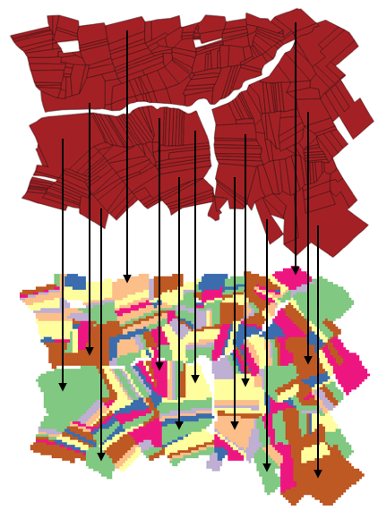
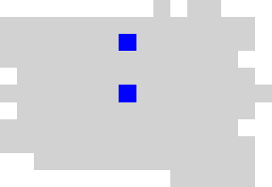
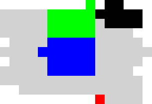
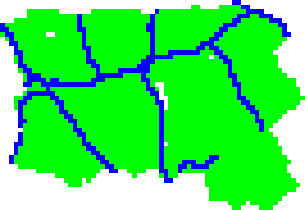
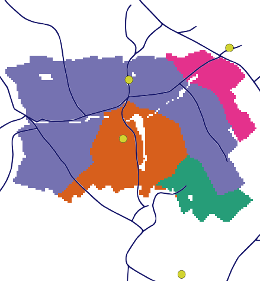

# Examples

|   |   |
|---|---|
|[area](#area)|GPM Implementation strategy 'area' and creating map.|
|[border](#border)|Compute the neighbors of some Brazilian states.|
|[contains](#contains)|Example that connects cells to the communities located within them.|
|[distance-all](#distance-all)|Computes neighborhoods based on Euclidean distances from cells to all communities.|
|[distance-limit](#distance-limit)|Computes neighborhoods based on Euclidean distances from cells to communities within 4km of distance.|
|[length](#length)|Compute a GPM based on the intersection between cells and lines.|
|[network](#network)|GPM Implementation creating maps.|

## [area](../examples/area.lua)

{class="center"}

  
  
GPM Implementation strategy 'area' and creating map. Create a map based on the cells and polygons.  
  

## [border](../examples/border.lua)

Compute the neighbors of some Brazilian states. The weight is based on the proportion beteween the intersection area and the perimeter of the state.  
  

## [contains](../examples/contains.lua)

{class="center"}

  
  
Example that connects cells to the communities located within them. In this example, there are only two communities locaded within the cells. The output image shows how many neighbors each cell has.  
  

## [distance-all](../examples/distance-all.lua)

{class="center"}

  
  
Computes neighborhoods based on Euclidean distances from cells to all communities. It considers a neighbor only a community is less or equals than 4km from the centroid of the cell. The output image shows how many neighbors each cell has.  
  

## [distance-limit](../examples/distance-limit.lua)

{class="center"}

  
  
Computes neighborhoods based on Euclidean distances from cells to communities within 4km of distance. It considers a neighbor only a community is less or equals than 4km from the centroid of the cell. The output image shows how many neighbors each cell has.  
  

## [length](../examples/length.lua)

{class="center"}

  
  
Compute a GPM based on the intersection between cells and lines. A Cell is connected to a line if there is some intersection between them.  
  

## [network](../examples/network.lua)

{class="center"}

  
  
GPM Implementation creating maps. Creates maps based on distance routes, entry points and exit points. This test has commented lines, to create and validate files. This example creates a 'gpm.gpm' file if you have another file with this name will be deleted.