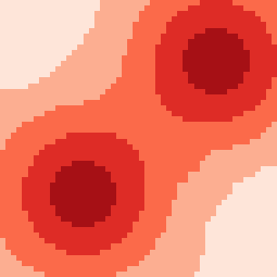
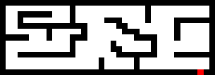
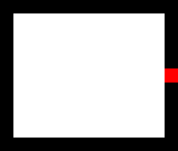
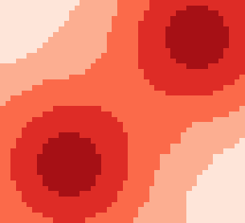

# Data

|   |   |
|---|---|
|[crossRoom.labyrinth](#crossRoom.labyrinth)|A room with a cross in the middle.|
|[default.pgm](#default.pgm)|The traditional sugarscape.|
|[maze.labyrinth](#maze.labyrinth)|A small maze.|
|[room.labyrinth](#room.labyrinth)|An empty room.|
|[small.pgm](#small.pgm)|A small sugarscape.|

# Directory

|   |   |
|---|---|
|[error](#error)|Some files with error, used for internal tests.|

## crossRoom.labyrinth

{class="center"}

  
  
A room with a cross in the middle.

- **File:** [crossRoom.labyrinth](../data/crossRoom.labyrinth)
- **Source:** TerraME team

## default.pgm

{class="center"}

  
  
The traditional sugarscape.

- **File:** [default.pgm](../data/default.pgm)
- **Source:** TerraME team

## maze.labyrinth

{class="center"}

  
  
A small maze.

- **File:** [maze.labyrinth](../data/maze.labyrinth)
- **Source:** TerraME team

## room.labyrinth

{class="center"}

  
  
An empty room.

- **File:** [room.labyrinth](../data/room.labyrinth)
- **Source:** TerraME team

## small.pgm

{class="center"}

  
  
A small sugarscape.

- **File:** [small.pgm](../data/small.pgm)
- **Source:** TerraME team

## error

Some files with error, used for internal tests.

- **Files:** 2
- **Extensions:** labyrinth
- **Source:** TerraME team