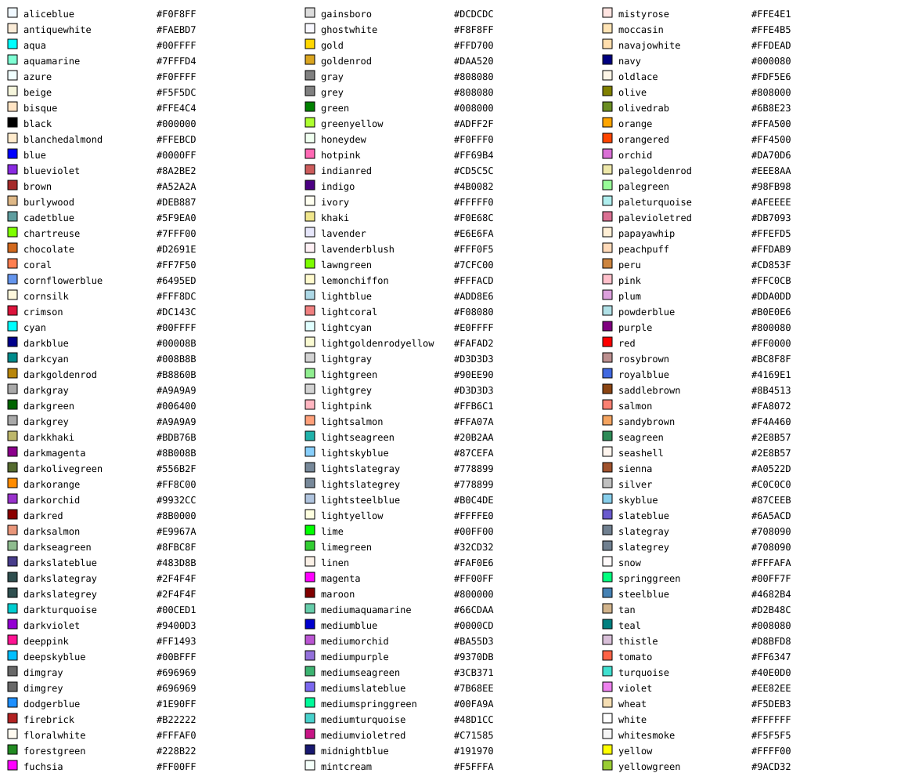

# Color

## Functions

|   |   |
|---|---|
|[color](#color)|Validate a color in different formats and return it in RGBA.|

## **color** 

Validate a color in different formats and return it in RGBA.  
  

### Arguments

- **alpha**: An optional number with the opacity for a color. The alpha parameter is a number between 0.0 (fully transparent) and 1.0 (fully opaque). The default value is 1.
- **classes**: An optional integer with the number of data classes. This argument is madatory to verify ColorBrewer format.
- **...**: Argument name. A mandatory string or table with the color. Colors can be described as strings using a color name, an RGB value, a HEX value, or even as a string with a ColorBrewer format (see [http://www.colorbrewer2.org](http://www.colorbrewer2.org)). The available color names are:  
    {class="center"} 
    These colors are defined by [www.w3.org](www.w3.org) (see [https://www.w3.org/TR/SVG/types.html#ColorKeywords](https://www.w3.org/TR/SVG/types.html#ColorKeywords)).

### Usage

```
import("publish")
print(color{color = "aqua"})
print(color{border = "blue"})
print(color{color = "red", alpha = 0.5})
print(color{color = {{255, 255, 255}}})
print(color{color = "Reds", classes = 3})
print(color{color = {{10, 10, 10}, {11, 11, 11}, {12, 12, 12, 0.5}}})
print(color{color = {"red", "green", "yellow"}})
print(color{color = {"#798174", "#261305", "#7c4c24"}})
```