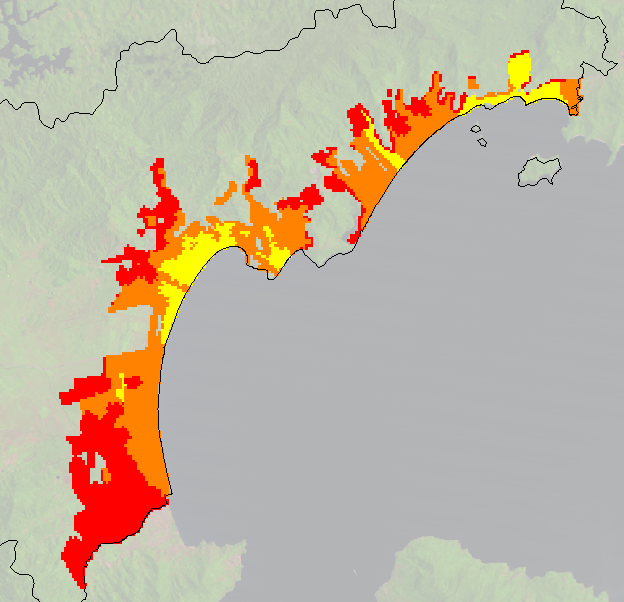
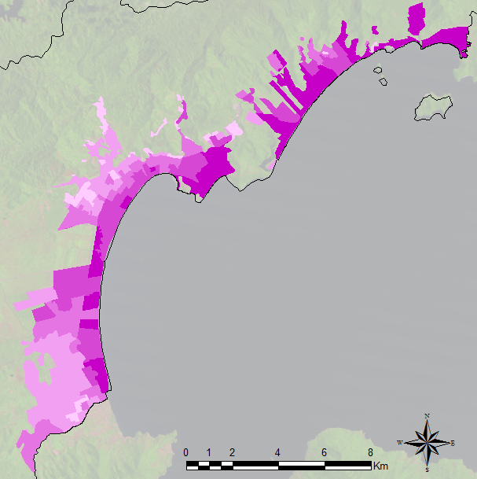
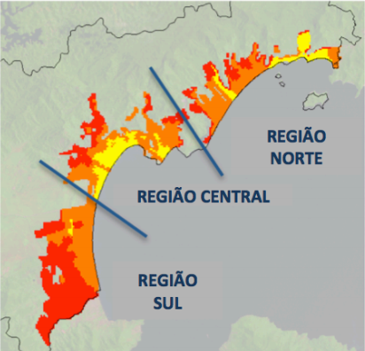
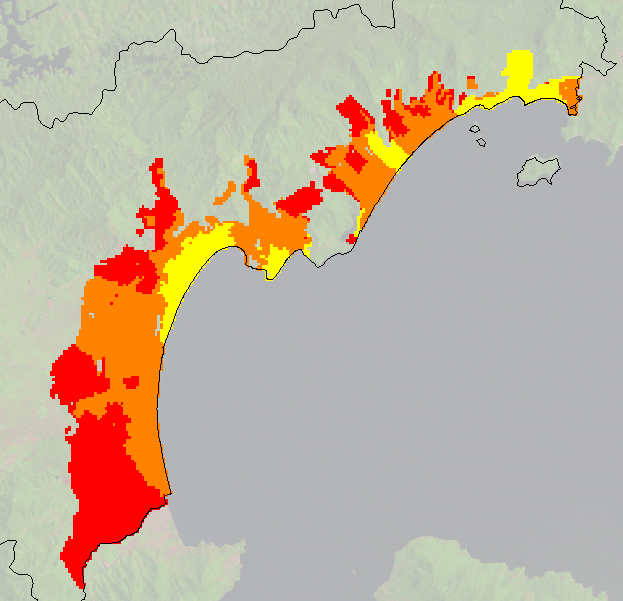
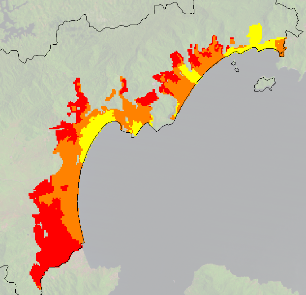
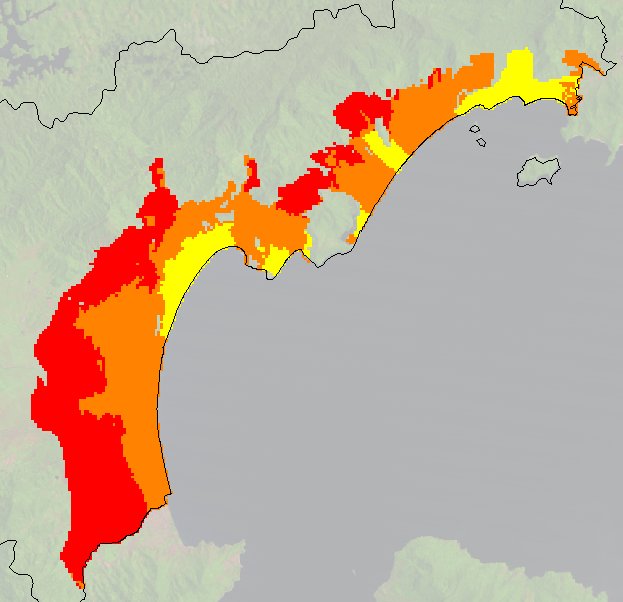
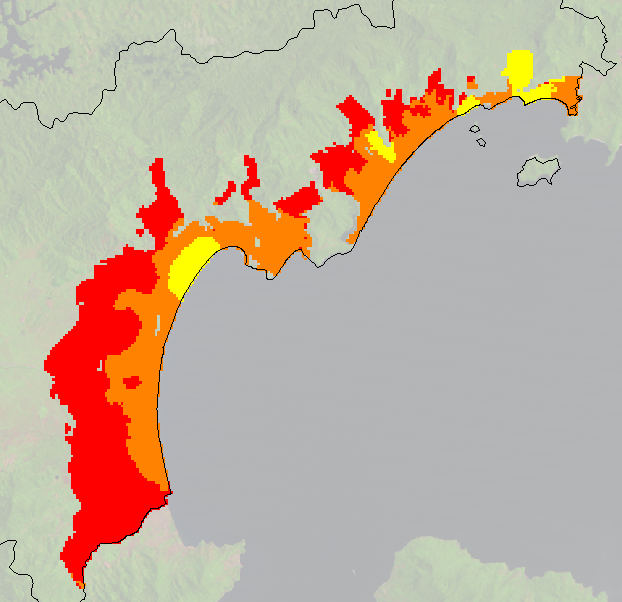
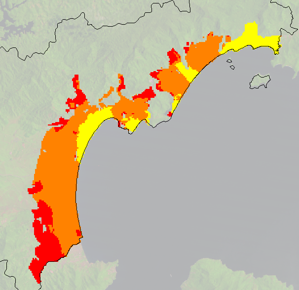

# Projects

## [arapiuns.tview](../data/arapiuns.tview)

Automatically created TerraView project file from [arapiuns.lua](../data/arapiuns.lua).

|   |   |   |
|---|---|---|
|**Layer**|**File**|**Description**|
|"trajectory"|[arapiuns_traj.shp](#arapiuns_traj.shp)|1 line.|
|"villages"|[AllCmmTab_210316OK.shp](#AllCmmTab_210316OK.shp)|49 points.|

## [brazil.tview](../data/brazil.tview)

Automatically created TerraView project file from [brazil.lua](../data/brazil.lua).

|   |   |   |
|---|---|---|
|**Layer**|**File**|**Description**|
|"biomes"|[br_biomes.shp](#br_biomes.shp)|6 polygons.|
|"states"|[br_states.shp](#br_states.shp)|27 polygons.|

## [caragua.tview](../data/caragua.tview)

Automatically created TerraView project file from [caragua.lua](../data/caragua.lua).

|   |   |   |
|---|---|---|
|**Layer**|**File**|**Description**|
|"baseline"|[simulation2025_baseline.shp](#simulation2025_baseline.shp)|216 polygons.|
|"less"|[simulation2025_lessgrowth.shp](#simulation2025_lessgrowth.shp)|136 polygons.|
|"limit"|[caragua.shp](#caragua.shp)|1 polygon.|
|"plus"|[simulation2025_plusgrowth.shp](#simulation2025_plusgrowth.shp)|134 polygons.|
|"poorer"|[simulation2025_poorer.shp](#simulation2025_poorer.shp)|104 polygons.|
|"real"|[caragua_classes2010_regioes.shp](#caragua_classes2010_regioes.shp)|201 polygons.|
|"regions"|[regions.shp](#regions.shp)|3 polygons.|
|"richer"|[simulation2025_richer_final.shp](#simulation2025_richer_final.shp)|134 polygons.|
|"use"|[occupational2010.shp](#occupational2010.shp)|276 polygons.|

## [emas.tview](../data/emas.tview)

Automatically created TerraView project file from [emas.lua](../data/emas.lua).

|   |   |   |
|---|---|---|
|**Layer**|**File**|**Description**|
|"cells"|[emas.shp](#emas.shp)|5514 cells (polygons) with resolution 500 built from layer "limit".|
|"firebreak"|[emas-firebreak.shp](#emas-firebreak.shp)|45 lines.|
|"limit"|[emas-limit.shp](#emas-limit.shp)|1 polygon.|
|"river"|[emas-river.shp](#emas-river.shp)|208 lines.|

## [sp.tview](../data/sp.tview)

Automatically created TerraView project file from [sp.lua](../data/sp.lua).

|   |   |   |
|---|---|---|
|**Layer**|**File**|**Description**|
|"municipalities"|[sp_municipalities.shp](#sp_municipalities.shp)|740 polygons.|

## [temporal-data.tview](../data/temporal-data.tview)

Automatically created TerraView project file from [temporal-data.lua](../data/temporal-data.lua).

|   |   |   |
|---|---|---|
|**Layer**|**File**|**Description**|
|"data"|[temporal-data.shp](#temporal-data.shp)|9 polygons.|

# Data

|   |   |
|---|---|
|[AllCmmTab_210316OK.shp](#AllCmmTab_210316OK.shp)|The riverine communities at Arapiuns (PA).|
|[arapiuns_traj.shp](#arapiuns_traj.shp)|Route on the Arapiuns River.|
|[br_biomes.shp](#br_biomes.shp)|Brazilian biomes.|
|[br_states.shp](#br_states.shp)|Brazilian states.|
|[caragua.shp](#caragua.shp)|Caragua municipality, in Sao Paulo State, Brazil.|
|[caragua_classes2010_regioes.shp](#caragua_classes2010_regioes.shp)|Social Classe 2010 Real.|
|[caragua_classes2010_regioes.tif](#caragua_classes2010_regioes.tif)|Social Classe 2010 Real.|
|[emas.shp](#emas.shp)|Automatically created file in project "emas.tview".|
|[occupational2010.shp](#occupational2010.shp)|Occupational Classes (IBGE, 2010).|
|[regions.shp](#regions.shp)|Caragua municipality divided into three regions.|
|[simulation2025_baseline.shp](#simulation2025_baseline.shp)|Baseline simulation for 2025.|
|[simulation2025_lessgrowth.shp](#simulation2025_lessgrowth.shp)|Less growth simulation in 2025.|
|[simulation2025_plusgrowth.shp](#simulation2025_plusgrowth.shp)|Plus growth simulation in 2025.|
|[simulation2025_poorer.shp](#simulation2025_poorer.shp)|Poorer people in Caragua in 2025.|
|[simulation2025_richer_final.shp](#simulation2025_richer_final.shp)|Richer people in Caragua in 2025.|
|[sp_municipalities.shp](#sp_municipalities.shp)|Sao Paulo municipalities.|
|[temporal-data.shp](#temporal-data.shp)|Test of temporal data to create graphic and table.|
|[uc_federais_2001.shp](#uc_federais_2001.shp)|Conservation units of Brazil.|
|[uc_federais_2009.shp](#uc_federais_2009.shp)|Conservation units of Brazil.|
|[uc_federais_2016.shp](#uc_federais_2016.shp)|Conservation units of Brazil.|
|[vegtype_2000_5880.tif](#vegtype_2000_5880.tif)|Vegetation Type 2000.|

# Directory

|   |   |
|---|---|
|[arapiuns](#arapiuns)|Photos of several riverine settlements.|
|[biomes](#biomes)|A set of images related to Brazilian biomes collected from the Internet.|

## AllCmmTab_210316OK.shp

The riverine communities at Arapiuns (PA).

- **Files:** [AllCmmTab_210316OK.dbf](../data/AllCmmTab_210316OK.dbf),
 [AllCmmTab_210316OK.prj](../data/AllCmmTab_210316OK.prj), 
[AllCmmTab_210316OK.shp](../data/AllCmmTab_210316OK.shp), [AllCmmTab_210316OK.shx](../data/AllCmmTab_210316OK.shx)
- **Representation:** point
- **Quantity:** 49
- **Projection:** ['WGS 84', with EPSG: 4326 (PROJ4: '+proj=longlat +datum=WGS84 +no_defs')](https://epsg.io/4326)
- **Source:** Escada et. al (2013) Infraestrutura, Serviços e Conectividade das Comunidades Ribeirinhas do Arapiuns, PA. Technical report, INPE.

|Attribute|Type|Description|
|---|---|---|
|ACAI|number|Acai.|
|AGUA|number|Water.|
|ARROZ|number|Rice.|
|BFAM|number|Bolsa Familia.|
|CACA|number|Hunting.|
|CASTANHA|number|Chestnut.|
|CFUT|number|Soccer field.|
|CMM2|string|Name of riverine community.|
|EJA|number|The schools of riverine settlements at Arapiuns.|
|ENERGIA|number|Energy.|
|ENSFUND2|number|The schools of riverine settlements at Arapiuns.|
|ENSINF|number|The schools of riverine settlements at Arapiuns.|
|FRUTAS|number|Fruits.|
|GADO|number|Cattle.|
|ICON|string|The name of marker icon.|
|IDDCM|number|Age of the community.|
|IGREJAS|number|Church.|
|INST|number|Governmental institutions.|
|LIXO|number|Garbage collection.|
|MAND|number|Manioc.|
|MANT|number|Where people usually buy food.|
|MERENDA|number|Lunch at schools.|
|MINERACAO|number|Mining.|
|NASSOC|number|Local institutions.|
|NPES|number|Population of the community.|
|Nome|string|Name of riverine community.|
|ORELHAO|number|Telephone.|
|PESCA|number|Fischery.|
|PSAU|number|Health center of riverine settlements at Arapiuns.|
|SALE|number|Saude e Alegria NGO.|
|UC|number|Conservation Unit.|

## arapiuns_traj.shp

Route on the Arapiuns River.

- **Files:** [arapiuns_traj.dbf](../data/arapiuns_traj.dbf), [arapiuns_traj.prj](../data/arapiuns_traj.prj),
 [arapiuns_traj.shp](../data/arapiuns_traj.shp), [arapiuns_traj.shx](../data/arapiuns_traj.shx)
- **Representation:** line
- **Quantity:** 1
- **Projection:** ['WGS 84', with EPSG: 4326 (PROJ4: '+proj=longlat +datum=WGS84 +no_defs')](https://epsg.io/4326)
- **Source:** Escada et. al (2013) Infraestrutura, Serviços e Conectividade das Comunidades Ribeirinhas do Arapiuns, PA. Technical report, INPE.

## br_biomes.shp

Brazilian biomes.

- **Files:** [br_biomes.dbf](../data/br_biomes.dbf), [br_biomes.prj](../data/br_biomes.prj), [br_biomes.shp](../data/br_biomes.shp), 
[br_biomes.shx](../data/br_biomes.shx)
- **Representation:** polygon
- **Quantity:** 6
- **Projection:** ['WGS 84', with EPSG: 4326 (PROJ4: '+proj=longlat +datum=WGS84 +no_defs')](https://epsg.io/4326)
- **Source:** IBGE

|Attribute|Type|Description|
|---|---|---|
|cover|number|Percentage of Brazil's area covered by the biome.|
|link|string|Link to a Wikipedia page with the description of the biome.|
|name|string|Name of the biome.|

## br_states.shp

Brazilian states.

- **Files:** [br_states.dbf](../data/br_states.dbf), [br_states.prj](../data/br_states.prj), [br_states.shp](../data/br_states.shp), 
[br_states.shx](../data/br_states.shx)
- **Representation:** polygon
- **Quantity:** 27
- **Projection:** ['WGS 84', with EPSG: 4326 (PROJ4: '+proj=longlat +datum=WGS84 +no_defs')](https://epsg.io/4326)
- **Source:** IBGE

|Attribute|Type|Description|
|---|---|---|
|NOMEUF2|string|Name of the state.|
|SIGLAUF3|string|An acronym for the state.|

## caragua.shp

Caragua municipality, in Sao Paulo State, Brazil.

- **Files:** [caragua.dbf](../data/caragua.dbf), [caragua.prj](../data/caragua.prj),[caragua.shp](../data/caragua.shp), [caragua.shx](../data/caragua.shx)
- **Representation:** polygon
- **Quantity:** 1
- **Projection:** ['WGS 84', with EPSG: 4326 (PROJ4: '+proj=longlat +datum=WGS84 +no_defs')](https://epsg.io/4326)
- **Source:** IBGE ([http://www.ibge.gov.br](http://www.ibge.gov.br))

|Attribute|Type|Description|
|---|---|---|
|idh|number|HDI indicators of Caraguatatuba.|
|name|string|Data name.|
|pib|number|Gross Domestic Product (GDP) of Caraguatatuba.|
|population|number|Population of Caraguatatuba.|

## caragua_classes2010_regioes.shp

{class="center"}

  
  
Social Classe 2010 Real.

- **Files:** [caragua_classes2010_regioes.dbf](../data/caragua_classes2010_regioes.dbf),
 [caragua_classes2010_regioes.prj](../data/caragua_classes2010_regioes.prj), [caragua_classes2010_regioes.shp](../data/caragua_classes2010_regioes.shp),
 [caragua_classes2010_regioes.shx](../data/caragua_classes2010_regioes.shx)
- **Representation:** polygon
- **Quantity:** 201
- **Projection:** ['WGS 84', with EPSG: 4326 (PROJ4: '+proj=longlat +datum=WGS84 +no_defs')](https://epsg.io/4326)
- **Source:** Feitosa et. al (2014) URBIS-Caraguá: Um Modelo de Simulação Computacional para a Investigação de Dinâmicas de Ocupação Urbana em Caraguatatuba, SP.

|Attribute|Type|Description|
|---|---|---|
|classe|number|Categorizes the social conditions of households in Caraguatatuba using classes A (3), B (2) or C (1).|

## caragua_classes2010_regioes.tif

{class="center"}

  
  
Social Classe 2010 Real.

- **File:** [caragua_classes2010_regioes.tif](../data/caragua_classes2010_regioes.tif)
- **Representation:** raster
- **Bands:** 1
- **Projection:** ['WGS 84', with EPSG: 4326 (PROJ4: '+proj=longlat +datum=WGS84 +no_defs')](https://epsg.io/4326)
- **Source:** Feitosa et. al (2014) URBIS-Caraguá: Um Modelo de Simulação Computacional para a Investigação de Dinâmicas de Ocupação Urbana em Caraguatatuba, SP.

|Band|Dummy|Type|Description|
|---|---|---|---|
|0|65535|number|Categorizes the social conditions of households in Caraguatatuba using classes A (3), B (2) or C (1).|

## emas.shp

Automatically created file with 5514 cells (polygons) with resolution 500 built from layer "limit", in project [emas.tview](#emas.tview).

- **Files:** [emas.dbf](../data/emas.dbf), [emas.prj](../data/emas.prj), [emas.shp](../data/emas.shp), [emas.shx](../data/emas.shx)
- **Representation:** polygon
- **Quantity:** 5514
- **Projection:** ['SAD69 / UTM zone 22S', with EPSG: 29192 (PROJ4: '+proj=utm +zone=22 +south +ellps=aust_SA +towgs84=-66.87,4.37,-38.52,0,0,0,0 +units=m +no_defs')](https://epsg.io/29192)

|Attribute|Type|Description|
|---|---|---|
|col|number|Cell's column.|
|firebreak|number|Operation presence from layer "firebreak".|
|id|string|Unique identifier (internal value).|
|river|number|Operation presence from layer "river".|
|row|number|Cell's row.|

## occupational2010.shp

{class="center"}

  
  
Occupational Classes (IBGE, 2010).

- **Files:** [occupational2010.dbf](../data/occupational2010.dbf), [occupational2010.prj](../data/occupational2010.prj), [occupational2010.shp](../data/occupational2010.shp), [occupational2010.shx](../data/occupational2010.shx)
- **Representation:** polygon
- **Quantity:** 276
- **Projection:** ['WGS 84', with EPSG: 4326 (PROJ4: '+proj=longlat +datum=WGS84 +no_defs')](https://epsg.io/4326)
- **Source:** Feitosa et. al (2014) URBIS-Caraguá: Um Modelo de Simulação Computacional para a Investigação de Dinâmicas de Ocupação Urbana em Caraguatatuba, SP.

|Attribute|Type|Description|
|---|---|---|
|uso|number|The percentage of houses and apartments inside such areas that is typically used in summer vacations and holidays.|

## regions.shp

{class="center"}

  
  
Caragua municipality divided into three regions.

- **Files:** [regions.dbf](../data/regions.dbf), [regions.prj](../data/regions.prj), [regions.shp](../data/regions.shp), [regions.shx](../data/regions.shx)
- **Representation:** polygon
- **Quantity:** 3
- **Projection:** ['WGS 84', with EPSG: 4326 (PROJ4: '+proj=longlat +datum=WGS84 +no_defs')](https://epsg.io/4326)
- **Source:** H. Guerra and P. Andrade

|Attribute|Type|Description|
|---|---|---|
|name|string|Regions of Caraguatatuba, North (1), Central (2) and South (3).|

## simulation2025_baseline.shp

{class="center"}

  
  
Baseline simulation for 2025.

- **Files:** [simulation2025_baseline.dbf](../data/simulation2025_baseline.dbf), 
[simulation2025_baseline.prj](../data/simulation2025_baseline.prj), [simulation2025_baseline.shp](../data/simulation2025_baseline.shp), [simulation2025_baseline.shx](../data/simulation2025_baseline.shx)
- **Representation:** polygon
- **Quantity:** 216
- **Projection:** ['WGS 84', with EPSG: 4326 (PROJ4: '+proj=longlat +datum=WGS84 +no_defs')](https://epsg.io/4326)
- **Source:** Feitosa et. al (2014) URBIS-Caraguá: Um Modelo de Simulação Computacional para a Investigação de Dinâmicas de Ocupação Urbana em Caraguatatuba, SP.

|Attribute|Type|Description|
|---|---|---|
|classe|number|Categorizes the social conditions of households in Caraguatatuba using classes A (3), B (2) or C (1).|

## simulation2025_lessgrowth.shp

{class="center"}

  
  
Less growth simulation in 2025.

- **Files:** [simulation2025_lessgrowth.dbf](../data/simulation2025_lessgrowth.dbf), [simulation2025_lessgrowth.prj](../data/simulation2025_lessgrowth.prj),
 [simulation2025_lessgrowth.shp](../data/simulation2025_lessgrowth.shp), [simulation2025_lessgrowth.shx](../data/simulation2025_lessgrowth.shx)
- **Representation:** polygon
- **Quantity:** 136
- **Projection:** ['WGS 84', with EPSG: 4326 (PROJ4: '+proj=longlat +datum=WGS84 +no_defs')](https://epsg.io/4326)
- **Source:** Feitosa et. al (2014) URBIS-Caraguá: Um Modelo de Simulação Computacional para a Investigação de Dinâmicas de Ocupação Urbana em Caraguatatuba, SP.

|Attribute|Type|Description|
|---|---|---|
|classe|number|Categorizes the social conditions of households in Caraguatatuba using classes A (3), B (2) or C (1).|

## simulation2025_plusgrowth.shp

{class="center"}

  
  
Plus growth simulation in 2025.

- **Files:** [simulation2025_plusgrowth.dbf](../data/simulation2025_plusgrowth.dbf), [simulation2025_plusgrowth.prj](../data/simulation2025_plusgrowth.prj),
 [simulation2025_plusgrowth.shp](../data/simulation2025_plusgrowth.shp), [simulation2025_plusgrowth.shx](../data/simulation2025_plusgrowth.shx)
- **Representation:** polygon
- **Quantity:** 134
- **Projection:** ['WGS 84', with EPSG: 4326 (PROJ4: '+proj=longlat +datum=WGS84 +no_defs')](https://epsg.io/4326)
- **Source:** Feitosa et. al (2014) URBIS-Caraguá: Um Modelo de Simulação Computacional para a Investigação de Dinâmicas de Ocupação Urbana em Caraguatatuba, SP.

|Attribute|Type|Description|
|---|---|---|
|classe|number|Categorizes the social conditions of households in Caraguatatuba using classes A (3), B (2) or C (1).|

## simulation2025_poorer.shp

{class="center"}

  
  
Poorer people in Caragua in 2025.

- **Files:** [simulation2025_poorer.dbf](../data/simulation2025_poorer.dbf), [simulation2025_poorer.prj](../data/simulation2025_poorer.prj), 
[simulation2025_poorer.shp](../data/simulation2025_poorer.shp), [simulation2025_poorer.shx](../data/simulation2025_poorer.shx)
- **Representation:** polygon
- **Quantity:** 104
- **Projection:** ['WGS 84', with EPSG: 4326 (PROJ4: '+proj=longlat +datum=WGS84 +no_defs')](https://epsg.io/4326)
- **Source:** Feitosa et. al (2014) URBIS-Caraguá: Um Modelo de Simulação Computacional para a Investigação de Dinâmicas de Ocupação Urbana em Caraguatatuba, SP.

|Attribute|Type|Description|
|---|---|---|
|classe|number|Categorizes the social conditions of households in Caraguatatuba using classes A (3), B (2) or C (1).|

## simulation2025_richer_final.shp

{class="center"}

  
  
Richer people in Caragua in 2025.

- **Files:** [simulation2025_richer_final.dbf](../data/simulation2025_richer_final.dbf), [simulation2025_richer_final.prj](../data/simulation2025_richer_final.prj),
 [simulation2025_richer_final.shp](../data/simulation2025_richer_final.shp), [simulation2025_richer_final.shx](../data/simulation2025_richer_final.shx)
- **Representation:** polygon
- **Quantity:** 134
- **Projection:** ['WGS 84', with EPSG: 4326 (PROJ4: '+proj=longlat +datum=WGS84 +no_defs')](https://epsg.io/4326)
- **Source:** Feitosa et. al (2014) URBIS-Caraguá: Um Modelo de Simulação Computacional para a Investigação de Dinâmicas de Ocupação Urbana em Caraguatatuba, SP.

|Attribute|Type|Description|
|---|---|---|
|classe|number|Categorizes the social conditions of households in Caraguatatuba using classes A (3), B (2) or C (1).|

## sp_municipalities.shp

Sao Paulo municipalities.

- **Files:** [sp_municipalities.dbf](../data/sp_municipalities.dbf), [sp_municipalities.prj](../data/sp_municipalities.prj), 
[sp_municipalities.qpj](../data/sp_municipalities.qpj), [sp_municipalities.shp](../data/sp_municipalities.shp), [sp_municipalities.shx](../data/sp_municipalities.shx)
- **Representation:** polygon
- **Quantity:** 740
- **Projection:** ['WGS 84', with EPSG: 4326 (PROJ4: '+proj=longlat +datum=WGS84 +no_defs')](https://epsg.io/4326)
- **Source:** IBGE

|Attribute|Type|Description|
|---|---|---|
|id|number|Unique identifier.|
|nome|string|Name of the city.|
|pib|number|Gross Domestic Product (GDP).|
|populacao|number|Population size.|
|uf|string|States of Brazil.|

## temporal-data.shp

Test of temporal data to create graphic and table.

- **Files:** [temporal-data.dbf](../data/temporal-data.dbf), [temporal-data.prj](../data/temporal-data.prj), [temporal-data.qpj](../data/temporal-data.qpj), [temporal-data.shp](../data/temporal-data.shp), [temporal-data.shx](../data/temporal-data.shx)
- **Representation:** polygon
- **Quantity:** 9
- **Projection:** ['WGS 84', with EPSG: 4326 (PROJ4: '+proj=longlat +datum=WGS84 +no_defs')](https://epsg.io/4326)
- **Source:** CCST.

|Attribute|Type|Description|
|---|---|---|
|AGB3rdM70, BGB3rdM70|number|Temporal data test bloc 7.|
|B2nd, b2_agb, AGB3rd, BGB3rd, DW3rd, Litter3rd, soma_dg|number|Test data bloc 2.|
|Lit3rdM70, DW3rdM70, AGB3M70cor|number|Test data bloc 5.|
|Shape_Leng, Shape_Area|number|Temporal data test bloc 10.|
|averAGBDeg, b12_3rdInv|number|Test data bloc 6.|
|b12|number|Test data b12.|
|b3_agb, B2ndM100|number|Test data bloc 3.|
|b3_perc1, b3_perc2, b3_perc3|number|Temporal data test bloc 5.|
|col|number|Column.|
|col_1|number|Identifier col 1.|
|d|number|Identifier d.|
|d_area16, d_inita01, d_forest|number|Temporal data test bloc 6.|
|d_inita, d_area02, d_area03, d_area04, d_area05, d_area06, d_area07, d_area08, d_area09, d_area10, d_area11, d_area12, d_area13, d_area14, d_area15|number|Temporal data test bloc 2.|
|d_inita05, b4_agb, O, soma_d|number|Test data bloc 4.|
|deterCR|number|Deter.|
|dg_darea06, dg_darea07, dg_darea08, dg_darea09, dg_darea10, dg_darea11, dg_darea12|number|Temporal data test bloc 3.|
|dg_darea13, dg_darea14|number|Temporal data test bloc 4.|
|dg_darea15, dg_darea16, dg_darea17, dg_darea18, dg_darea19|number|Temporal data test bloc 9.|
|f|number|Identifier f.|
|f16, d16, ag_slope_1, e_roads, e_proads, e_railway, e_connmkt, e_hidro, e_beef, e_wood, e_soysug, e_min, e_urban100, as_pland_s, as_pland_m, as_pland_b, c_sett11, c_nsett11, c_hidreopc, c_ucpi12, c_ussapa12|number|Temporal data test bloc 1.|
|for06_test, for06_area|number|Temporal data test bloc 8.|
|forest02|number|Forest 02.|
|forest06|number|Forest 06.|
|id|string|Identifying of label.|
|id_1|string|Identifier id 1.|
|log_CrRaso, log_Degrad, log_Regen|number|Temporal data test bloc 13.|
|log_pDG06, dAcc_ant, pDG06, TIndigena, area_disp|number|Test data bloc 7.|
|mcwd06, mcwd07, mcwd08, mcwd09, mcwd10, mcwd11, mcwd12, mcwd13, mcwd14, mcwd15, mcwd16|number|Temporal data test bloc 11.|
|min_mcwd|number|Identifier MCWD.|
|outros|number|outhers.|
|pTrjCrRaso, pTrjDegrad, pTrjRegen|number|Temporal data test bloc 12.|
|p19class27, d_recente, CAR_vazio, f_recente, e_urban10, drec, frec, OBJECTID, Join_Cou_1, TARGET_F_1|number|Test data bloc 1.|
|row|number|Row.|
|row_1|number|Identifier row_1.|

## uc_federais_2001.shp

Conservation units of Brazil.

- **Files:** [uc_federais_2001.dbf](../data/uc_federais_2001.dbf), [uc_federais_2001.prj](../data/uc_federais_2001.prj), 
[uc_federais_2001.qpj](../data/uc_federais_2001.qpj), [uc_federais_2001.shp](../data/uc_federais_2001.shp), [uc_federais_2001.shx](../data/uc_federais_2001.shx)
- **Representation:** polygon
- **Quantity:** 80
- **Projection:** ['WGS 84', with EPSG: 4326 (PROJ4: '+proj=longlat +datum=WGS84 +no_defs')](https://epsg.io/4326)
- **Source:** INCT.

|Attribute|Type|Description|
|---|---|---|
|CoordRegio|string|Region coordinates.|
|IdUnidade|string|Unit id.|
|SiglaGrupo|string|Group initials.|
|UF|string|States of Brazil.|
|administra|string|Administration.|
|anoCriacao|number|Creation year.|
|areaHa|number|Area.|
|atoLegal|string|Legal.|
|biomaCRL|string|Biome CRL.|
|biomaIBGE|string|Biome IBGE.|
|categoria|string|Category.|
|codCat|number|Code.|
|codUso|number|Code.|
|codigoCnuc|string|Unique identifier.|
|geometriaA|string|Geometry.|
|municipios|string|Municipalities.|
|nome|string|Name of the unit.|
|perimetroM|number|Perimeter.|
|sigla|string|Initials.|
|tipo|string|Type.|

## uc_federais_2009.shp

Conservation units of Brazil.

- **Files:** [uc_federais_2009.dbf](../data/uc_federais_2009.dbf), [uc_federais_2009.prj](../data/uc_federais_2009.prj), 
[uc_federais_2009.qpj](../data/uc_federais_2009.qpj), [uc_federais_2009.shp](../data/uc_federais_2009.shp), [uc_federais_2009.shx](../data/uc_federais_2009.shx)
- **Representation:** polygon
- **Quantity:** 130
- **Projection:** ['WGS 84', with EPSG: 4326 (PROJ4: '+proj=longlat +datum=WGS84 +no_defs')](https://epsg.io/4326)
- **Source:** INCT.

|Attribute|Type|Description|
|---|---|---|
|CoordRegio|string|Region coordinates.|
|IdUnidade|string|Unit id.|
|SiglaGrupo|string|Group initials.|
|UF|string|States of Brazil.|
|administra|string|Administration.|
|anoCriacao|number|Creation year.|
|areaHa|number|Area.|
|atoLegal|string|Legal.|
|biomaCRL|string|Biome CRL.|
|biomaIBGE|string|Biome IBGE.|
|categoria|string|Category.|
|codCat|number|Code.|
|codUso|number|Code.|
|codigoCnuc|string|Unique identifier.|
|geometriaA|string|Geometry.|
|municipios|string|Municipalities.|
|nome|string|Name of the unit.|
|perimetroM|number|Perimeter.|
|sigla|string|Initials.|
|tipo|string|Type.|

## uc_federais_2016.shp

Conservation units of Brazil.

- **Files:** [uc_federais_2016.dbf](../data/uc_federais_2016.dbf), [uc_federais_2016.prj](../data/uc_federais_2016.prj), 
[uc_federais_2016.qpj](../data/uc_federais_2016.qpj), [uc_federais_2016.shp](../data/uc_federais_2016.shp), [uc_federais_2016.shx](../data/uc_federais_2016.shx)
- **Representation:** polygon
- **Quantity:** 140
- **Projection:** ['WGS 84', with EPSG: 4326 (PROJ4: '+proj=longlat +datum=WGS84 +no_defs')](https://epsg.io/4326)
- **Source:** INCT.

|Attribute|Type|Description|
|---|---|---|
|CoordRegio|string|Region coordinates.|
|IdUnidade|string|Unit id.|
|SiglaGrupo|string|Group initials.|
|UF|string|States of Brazil.|
|administra|string|Administration.|
|anoCriacao|number|Creation year.|
|areaHa|number|Area.|
|atoLegal|string|Legal.|
|biomaCRL|string|Biome CRL.|
|biomaIBGE|string|Biome IBGE.|
|categoria|string|Category.|
|codCat|number|Code.|
|codUso|number|Code.|
|codigoCnuc|string|Unique identifier.|
|geometriaA|string|Geometry.|
|municipios|string|Municipalities.|
|nome|string|Name of the unit.|
|perimetroM|number|Perimeter.|
|sigla|string|Initials.|
|tipo|string|Type.|

## vegtype_2000_5880.tif

Vegetation Type 2000.

- **File:** [vegtype_2000_5880.tif](../data/vegtype_2000_5880.tif)
- **Representation:** raster
- **Bands:** 1
- **Projection:** ['SIRGAS 2000 / Brazil Polyconic', with EPSG: 5880 (PROJ4: '+proj=poly +lat_0=0 +lon_0=-54 +x_0=5000000 +y_0=10000000 +ellps=GRS80 +towgs84=0,0,0,0,0,0,0 +units=m +no_defs')](https://epsg.io/5880)
- **Source:** Inland, INPE.

|Band|Dummy|Type|Description|
|---|---|---|---|
|0|-999000000|number|Vegetation classes.|

## arapiuns

Photos of several riverine settlements.

- **Files:** 49
- **Extensions:** jpg
- **Source:** Escada et. al (2013) Infraestrutura, Serviços e Conectividade das Comunidades Ribeirinhas do Arapiuns, PA. Technical report, INPE.

## biomes

A set of images related to Brazilian biomes collected from the Internet.

- **Files:** 6
- **Extensions:** jpg
- **Source:** Google and Wikipedia